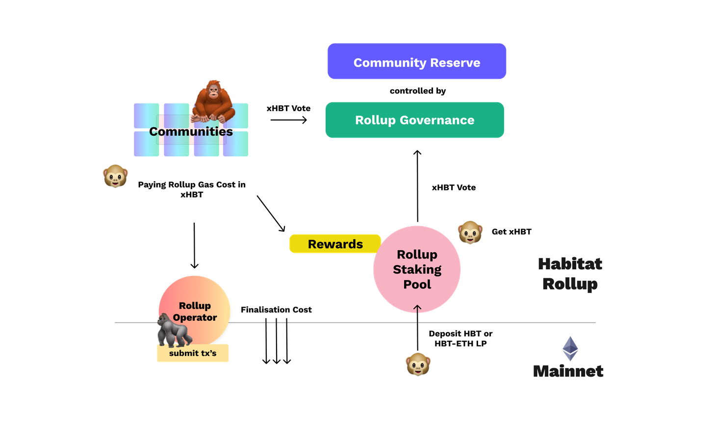

# Rollup Economy v1

#### Staking and utility of HBT tokens inside the Habitat Rollup

The Habitat ecosystem is build to assure high security of user funds and to incentivize participation to grow the Habitat.

As announced on the [0xhabitat.org/token](https://0xhabitat.org/token) website and the tokennomics [blog posts](https://0xhabitat.substack.com/p/hbt-token-design-and-economics-) - we hereby finalise the utility of HBT in Habitat v1.

## **Staking HBT**

Staking on Habitat grants you the right to vote on Habitat’s further development. Stake your tokens on proposals about new features or rollup parameters. In addition, HBT Stakeholders receive operator rewards from the rollup traffic.

To enter the staking pool **HBT** or **ETH-HBT LP** holders deposit their tokens on the rollup.

When HBT or ETH-HBT LP are deposited the same amount of xHBT becomes available on the Habitat rollup.

> 1 HBT = 1 xHBT // 1 HBT-ETH LP = 1 xHBT (ratio up for governance)

xHBT is the official governance token and can be transferred, delegated or staked on proposals.

## Transaction Cost on Habitat

Each transaction on Habitat is done with Ethereum Mainnet security. Therefore gas costs are needed to fund block submissions on Ethereum. On Habitat gas is paid with HBT (xHBT on Habitat). The gas fees are subsidized through a funded operator pool.

To interact with Habitat users need to fund a personal pre-paid balance with xHBT. This balance is used to pay for any type of transaction and votes on Habitat. We call it the “Gas-Tank”. Fees are estimated, based on the throughput of the rollup. The final costs depend on the current mainnet gas cost and will be deducted from the balance.

The total gas cost consists of a 0.X% operator reward fee. That fee is distributed to all xHBT holders. The exact % amount is determined by xHBT community governance.

## Operator

The Operator bundles the transactions and finalizes them on mainnet. When the funded operator pool empties over time - HBT is sold for ETH to cover finalization costs.

## Community Reserve

There are 2M HBT circulating. In June more HBT will be unlocked - every week 420k HBT are dripping into the community reserve as xHBT on the Habitat rollup.

> See the [distribution plan](https://bit.ly/HBT-distribution) plan or [droplet contract](https://bit.ly/3aMDUwc) for more info.

The funds in the reserve are locked and subject to governance. Therefore not circulating. The HBT community decides on funding new features, modules or improvements.

### Possible allocation of funds

* Feature Farm Operations (new features + modules for Habitat)
* Mainnet Liquidity Rewards (rewarding liquidity providing)
* XAMM Liquidity Rewards (rewarding liquidity provider)
* or any other proposal which is created and accepted by the community.